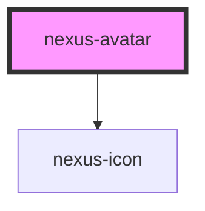

# nexus-avatar

<!-- Auto Generated Below -->

## Properties

| Property             | Attribute             | Description                                                                                                                                                                        | Type                                                                 | Default     |
| -------------------- | --------------------- | ---------------------------------------------------------------------------------------------------------------------------------------------------------------------------------- | -------------------------------------------------------------------- | ----------- |
| `alt`                | `alt`                 | Alternative text for accessibility.                                                                                                                                                | `string`                                                             | `''`        |
| `avatarClassName`    | `avatar-class-name`   | Specify a custom class to override styles of the Avatar component.The Prop 'avatarClassName' will be deprecated.                                                                   | `string`                                                             | `''`        |
| `avatarDark`         | `avatar-dark`         | The Prop 'avatarDark' will be deprecated.                                                                                                                                          | `boolean`                                                            | `false`     |
| `avatarImageSrc`     | `avatar-image-src`    | The Prop 'avatarImageSrc' will be deprecated. Kindly use the 'src' and 'type' Prop.                                                                                                | `string`                                                             | `''`        |
| `avatarLogoIcon`     | `avatar-logo-icon`    | The Prop 'avatarLogoIcon' will be deprecated. Kindly use the 'src' and 'type' Prop.                                                                                                | `string`                                                             | `''`        |
| `avatarNameDisplay`  | `avatar-name-display` | The Prop 'avatarNameDisplay' will be deprecated.                                                                                                                                   | `boolean`                                                            | `true`      |
| `avatarNotification` | `avatar-notification` | The Prop 'avatarNotification' will be deprecated. Kindly use the slot content with the notification.                                                                               | `string`                                                             | `''`        |
| `avatarSize`         | `avatar-size`         | The Prop 'avatarSize' will be deprecated. Kindly use the 'size' Prop.                                                                                                              | `"lg" \| "md" \| "sm" \| "xl" \| "xs"`                               | `'md'`      |
| `avatarStatus`       | `avatar-status`       | The Prop 'avatarStatus' will be deprecated. Kindly use the 'status' Prop.                                                                                                          | `"" \| "inactive" \| "online"`                                       | `''`        |
| `description`        | `description`         | The Prop 'description' will be deprecated. Kindly use the 'alt' Prop.                                                                                                              | `string`                                                             | `''`        |
| `label`              | `label`               | Will be used as a description and formated as initials in case no src is provided and the 'type' value is selected as 'text'.                                                      | `string`                                                             | `''`        |
| `size`               | `size`                | Adjust the avatar size (xs = 12px, sm = 16px, md = 24px, lg = 48px, xl = 64px).                                                                                                    | `"lg" \| "md" \| "sm" \| "xl" \| "xs"`                               | `'md'`      |
| `src`                | `src`                 | The path to the svg/img when the 'type' value is selected as 'svg' or 'img' .                                                                                                      | `string`                                                             | `undefined` |
| `status`             | `status`              | Avatar connection status is 'none' by default. Valid options are status = "none" \| "default" \| "error" \| "success" \| "warning" \| "info"                                       | `"default" \| "error" \| "info" \| "none" \| "success" \| "warning"` | `'none'`    |
| `type`               | `type`                | Enables to load the avatar logo/image using img markup, Improves performance since it uses browser cache to save image and reduces repeated calls. type = "img" \| "svg" \| "text" | `"img" \| "svg" \| "text"`                                           | `'text'`    |
| `userName`           | `user-name`           | The Prop 'userName' will be deprecated. Kindly use the 'label' Prop.                                                                                                               | `string`                                                             | `''`        |

## Dependencies

### Depends on

- [nexus-icon](../nexus-icon)

### Graph

----------------------------------------------

